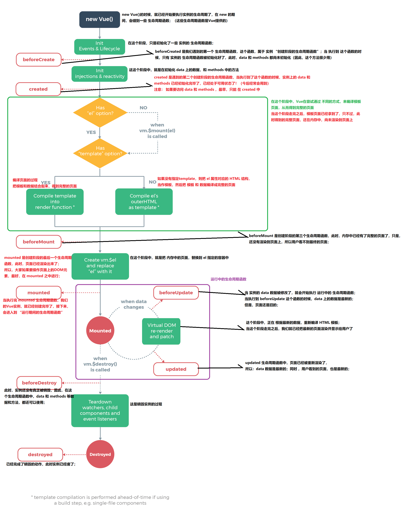

### 简介
+ 每个Vue实例在被创建后都要经过一系列的初始化过程，初始化过程中的每个阶段分别对应不同的操作过程，也就是生命周期中所发生的事件，又称生命周期钩子

### 生命周期分类
+ 创建期间的生命周期函数(从头到尾只执行一次)
    - beforeCreate
    - created(很重要函数，到此处后data和methods已经创建完成)
    - beforeMount
    - mounted(此时页面刚刚被渲染出来，如果要操作dom，最好在此函数中)
+ 运行期间的生命周期函数(0到多次，当有数据改变时就会重新调用)
    - beforeUpdate
    - updated
+ 销毁期间的生命周期函数(从头到尾只执行一次)
    - beforeDestroy
    - destroyed

### 图解
